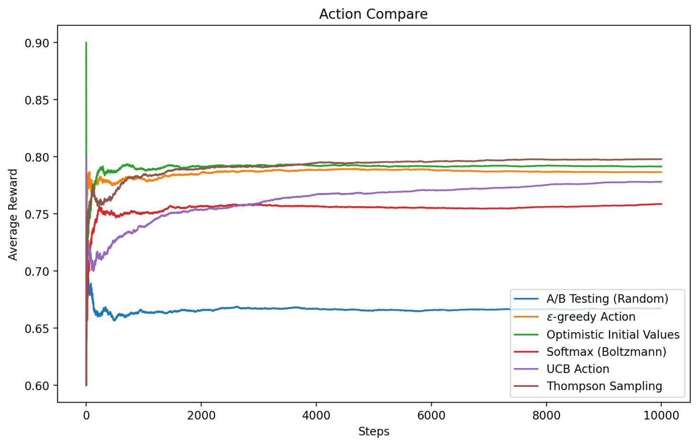
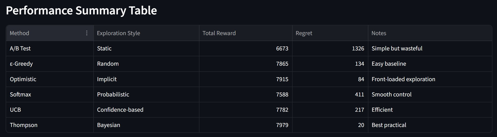

# 🎰 Multi-Armed Bandit Simulation

這是一個使用 Python 與 Streamlit 建立的多臂拉霸機 (Multi-Armed Bandit) 演算法視覺化模擬器。本作比較了六種經典強化學習探索策略的收斂表現與懊悔值 (Regret)。

## 🚀 Live Demo
👉 **[Click here to try the web app!](https://drl0325inclass.streamlit.app/)**

## 📊 Preview

### Action Compare


### Performance Summary


## 🧠 Implemented Algorithms
* A/B Testing (Random)
* Optimistic Initial Values
* $\epsilon$-Greedy
* Softmax (Boltzmann)
* Upper Confidence Bound (UCB)
* Thompson Sampling

## 🛠️ How to Run Locally

1. 安裝所需套件：
```bash
pip install -r requirements.txt
```